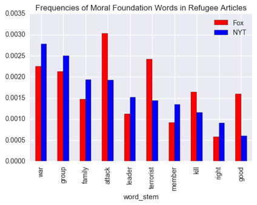

# Media Narratives on the Refugee Crisis

## Objective
I wanted to see if the New York Times and Fox News had different narratives on the 2015 refugee crisis.

## Data
I pulled 3000+ articles, letters, and transcripts from the NYT and Fox APIs. All articles were related to "refugees" and were dated to 2015.

I also used the "Moral Foundations Dictionary" provided [here](http://www.moralfoundations.org/othermaterials). Moral Foundations Theory is a sociological theory which argues that humans' moral concerns focus on 5 or so axes: harm, fairness, ingroup, authority, and purity. (Read more about the theory at the website.) The Moral Foundations dictionary contains a list of words shown to be relevant to each axis. I slightly edited the dictionary to contain multiple endings of each word (e.g. terrorist, terrorists, terrorism, etc.)

## Analysis
In the second Jupyter notebook I perform several analyses:
1. Topic modeling using non-negative matrix factorization. This didn't provide convincing, coherent categories for the articles. I ran NMF on just the NYT articles and also on the entire set from both sources.
2. Comparison of frequencies of Moral Foundations words in each news source. This analysis provided the most insight to the project. The graphic above shows the most relevant differences!
3. K-means clustering of articles based on their proportional concern with each Moral Foundations axis. Again the clusters here were not very coherent or insightful.

[Slides](./media/Reporting on Refugees in Fox News and the New York Times.pdf) from my project presentation are in the media folder.
